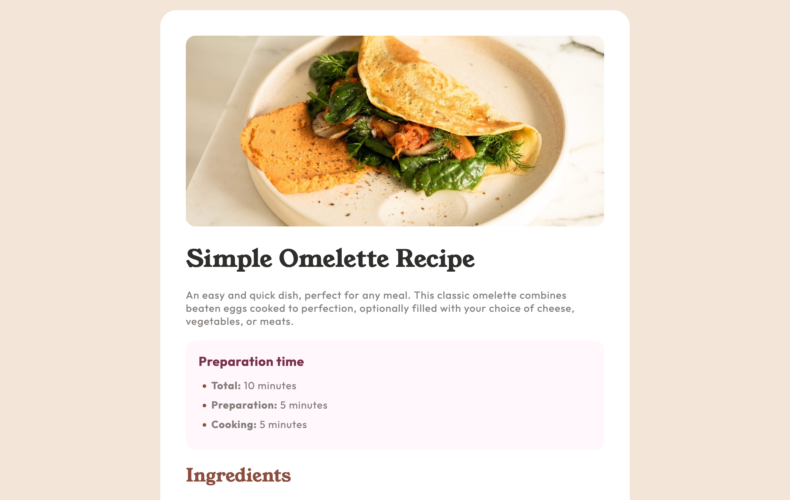

 Frontend Mentor - Recipe page solution

This is a solution to the [Recipe page challenge on Frontend Mentor](https://www.frontendmentor.io/challenges/recipe-page-KiTsR8QQKm). Frontend Mentor challenges help you improve your coding skills by building realistic projects. 

## Table of contents

- [Overview](#overview)
  - [The challenge](#the-challenge)
  - [Screenshot](#screenshot)
  - [Links](#links)
- [My process](#my-process)
  - [Built with](#built-with)
  - [What I learned](#what-i-learned)
  - [Continued development](#continued-development)
- [Author](#author)

## Overview

### Screenshot

### Links

- Solution URL: [Add solution URL here](https://your-solution-url.com)
- Live Site URL: https://rainbowsurfer137.github.io/recipe-page/

## My process

### Built with

- Semantic HTML
- CSS
- Flexbox

### What I learned

I learned to use ARIA attributes to enhance accessibility. I also discovered how to customize list item markers with different colors. Additionally, I used Figma to recreate the design for a more accurate and polished result.

### Continued development

I want to continue focusing on mobile-first design, improving code efficiency, and incorporating JavaScript for more dynamic elements.

## Author

- Frontend Mentor - [@rainbowsurfer137](https://www.frontendmentor.io/profile/rainbowsurfer137)